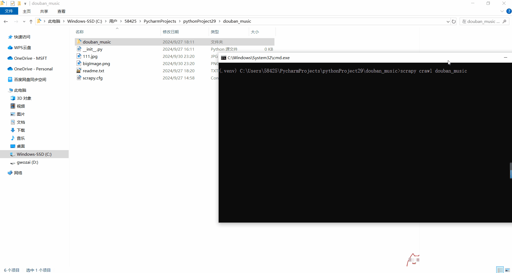

# scrapy 爬取豆瓣音乐列表

本项目通过 `opencv-python` 识别验证码，并使用 Scrapy 爬取豆瓣音乐相关内容。

## 安装依赖

在开始之前，请确保安装以下 Python 库：

```sh
pip install scrapy selenium opencv-python lxml pymongo pymysql
```

## 

### 验证码识别

利用 `opencv-python` 实现对验证码的自动识别。

### 豆瓣音乐爬取

运行以下命令来爬取豆瓣音乐内容：

- 爬取豆瓣音乐列表：
  ```sh
  scrapy crawl douban_music
  ```
- 爬取豆瓣音乐排行榜：
  ```sh
  scrapy crawl douban_music_chart
  ```

## 运行示例

运行结果示例如下：



## 更新日志

- 最后更新时间：2024/09/30 23:18

---

